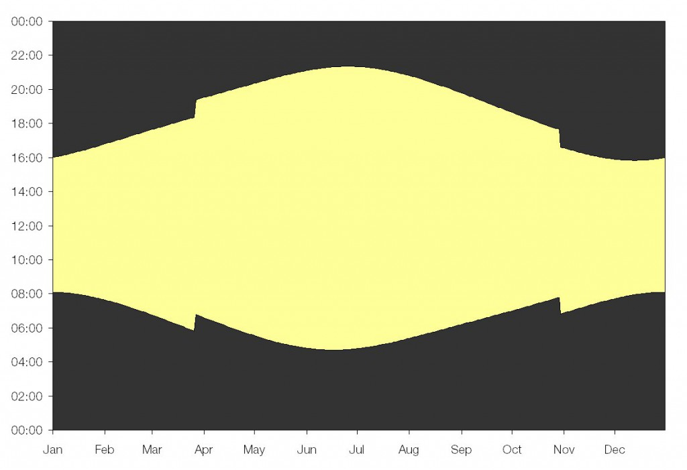

# Individual project - Energy saving automatic outside light

## Learning outcomes

The principal learning objectives for this project are:

- Implement a working microprocessor based system to achieve a more complex real world task
- Develop your ability to independently plan, organise and structure your code 
- Improve your grasp of the C language and writing your own functions

## Brief

Outside lights that respond to ambient light levels are commonplace (i.e. street lights, porch lights, garden lights etc). These types of lights switch on at dusk and then turn off at dawn. However, energy and money can be saved if these lights are switched off during the small hours of the morning (for example, between 1am and 5am), when there are very few people around. Many councils in the UK have implemented/trialled this idea for street lights (https://www.bbc.co.uk/news/uk-england-derbyshire-16811386). Your task is to use the knowledge of microcontrollers and hardware that you have gained in labs 1-3 from this module to develop a fully automated solution.

## Specification
Design and program a device that meets the following requirements:

1. Monitors light level with the LDR and turns on an LED in low light conditions (i.e. night-time) and off in bright conditions (i.e. daytime)
1. Displays the current hour of day on the LED array in binary
1. Turns the light off between approx. 1am and 5am
1. Adjusts for daylight savings time
1. Maintain synchronicity with the sun indefinitely
1. Be fully automatic (requires zero maintenance after installation)

Please use this GitHub repo to manage your software development and submit your individual project code.

## Supplementary information and help
At first the task may seem quite straightforward but there are several points that often prove more tricky. The first is how to test code during development? You could test in real world conditions but you would be limited to one test cycle per day and this would severely slow down your development and debugging progress. To get around this you could implement a "testing mode" and pretend that a day lasts 24 seconds. This could be done using a #define directive to switch between "normal" and "testing" modes for your code.

Adjusting for daylight savings time is not too tricky. The clocks always change (in the UK) on the last Sunday in March (they go forward an hour) and the last Sunday in October (they go back an hour). One method of achieving this is to initialise what day it is when device is first switched on (using manual input) and then keep track of the days that pass and what the day of the week it is. Another method might be to automatically figure out what time of year it is (see below). Also don't forget about leap years! 

No clock is perfect, they can all run slightly fast/slow and can by influenced be external factors such as temperature. Ultimately this will result in drift over time and eventually the time will drift so far out of sync with real time that it is meaningless. For the purposes of our device the main requirement is that it remains in sync with the sun. You could use light from the sun to keep your clock in sync. Although the length of daylight varies considerably during the year, the midpoint between dusk and dawn only varies by a few minutes. This is termed solar midnight approx. 12am or solar noon approx. 12pm. One method of staying in sync with the sun is to use the LDR and record/calculate when these times occur and adjust your clock accordingly. The length of daylight also tells us information about what time of year it is and can be used to help us know when to adjust for daylight savings time.

http://wordpress.mrreid.org/2010/10/31/why-change-the-clocks/

## Working thoughts
For the LDR controlled light, took into account 2 conditions:
(1) IF time is between 1-5am, make sure it is off.
(2) IF the LDR output value on the ADC is above a threshold (set arbituaraly), where low light yields a greater LDR value, set the LATD7 pin on high if the surrounding is dark, and low if the surroundings is bright. (Dark and bright based upon threshold selected)

Utilised the timer function, interrupt flag, LEDarray and LCD screen from taught labs to evaluate and debug on the way. LCD screen was helpful in observing leap-years and BST time changes etc. 

Main usage of the LATH3 pin to determine the clock's second pace. Whereby, the LATH3 pin is derived from the interrupt flag output. Made sure to reset the pin on every interrupt to ensure the second counter does not go on indefinitely.

Calender based upon seconds, which is build onto minutes, hours, then days, days of week, month and year. Utilised an array for daysInMonth, whereby a leapyear would cause the first element of the array to change from 28 to 29 (FEB). TESTING PHASE could be carried out by defining a variable for the Minute_length(min to sec ratio) and Hour_length (hour to min ratio) variable. For testing, this is set to 1, while for actual environemnt usage, this is set to 60. 

To Calibrate Daylight Savings time, I utilised if statements for the Month of March and October, whereby if the ticker passes any day that is >=25, which is a Sunday (March|Oct), it would cause a time shift in one direction (+1hr|-1hr). This would also change the BST variable, which acts as a flag for this two if statements. 

To calibrate my clock towards any shifts in time over the long run, I assumed that for all non-BST cases, the solar noon is exactly 12pm. And on the BST cases, its 1pm. Hence, I tracked when the LDR value hits the thresholds in dusk and dawn, which allowed me to calculate what is the difference between my clock's timer value compared to the actual solar noon time. This difference is accounted for depending on whether my clock's average of the dusk and dawn hours, yield a time before or after solar noon. If its before solar noon, it shows that the clock is running late compared to actual time etc. If clock runs late, add an hour, then substract the second difference from the timer. 

## Improvements 
I was thinking of perhaps calling a function for the calender, but the interrupt pin (RH3) caused some problems, which would bug my circuit into not running the calender code at all. Hence, the slight mess on the main function is seen. Maybe attempt to pick up pointers to better structure the calender code? I've tried what I could do, if theres more time, I would love to see how that would work out. 

Also, during the test with Ravi, My LDR gave an inverse value, which allowed the light to shine during bright environments, and turned the LED off during dark environments. This is clearly my mistake, I've debugged it now in the LDR.c file, by switching the if statements that compares the LDR output to the threshold values. This should be working nicely now.

